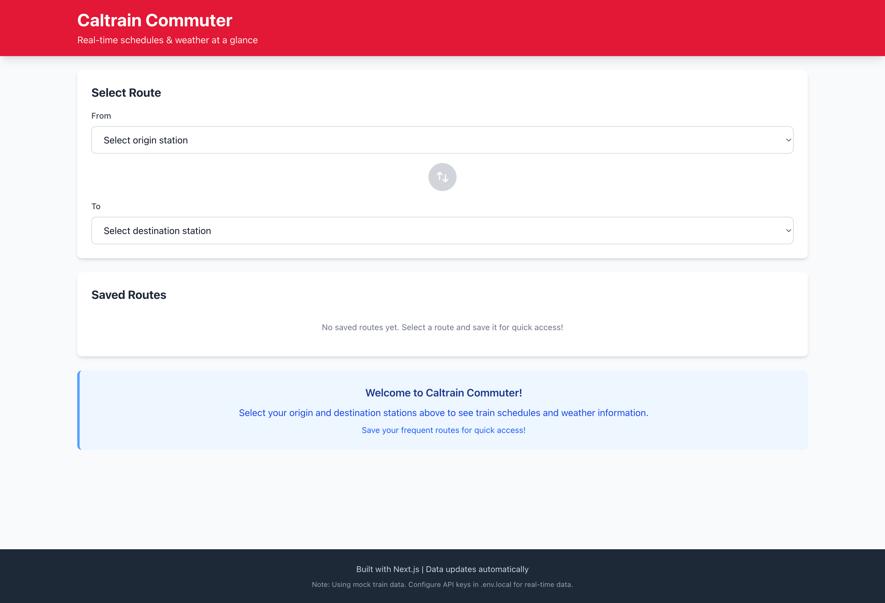
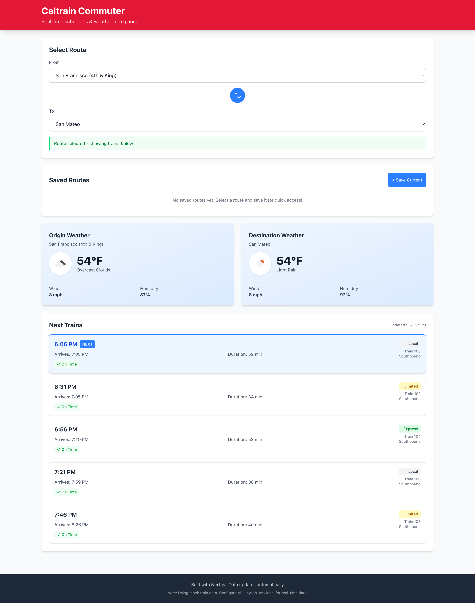

# Caltrain Commuter App

A Next.js web application that helps Caltrain commuters plan their trips by providing real-time train schedules, delay tracking, weather information, and event crowding alerts for a better commuting experience.


## 🚀 Live Demo

**Try it now:** [https://caltrain-commuter.observe-demo.com/](https://caltrain-commuter.observe-demo.com/)

The live demo is fully functional with real-time features enabled!

## 📸 Screenshots

<div align="center">
  
  <p><em>Main dashboard showing train schedules, weather, and saved routes</em></p>

  
  <p><em>Real-time delay tracking and event crowding alerts</em></p>
</div>

## Overview

This app provides comprehensive real-time information for Caltrain commuters across 25 main Caltrain stations from San Francisco to San Jose Diridon. Key capabilities include:

- 🚆 **Real-time train delays** via 511.org GTFS-Realtime API
- 🌤️ **Live weather** for origin and destination stations
- 🎫 **Event crowding alerts** for 9+ SF venues (Oracle Park, Chase Center, Moscone, etc.)
- 📍 **25 main Caltrain stations** with GPS coordinates (excluding South County Connector stations)
- 💾 **Save up to 5 routes** for quick access
- 🔄 **Auto-refresh** with optimized caching

**Ready to use immediately** - Works with mock data out of the box, configure API keys for real-time features.

## Features

- **Station Selection**: Choose from 25 main Caltrain stations (SF to San Jose Diridon) with easy swap functionality
  - **Note**: South County Connector stations (Tamien, Capitol, Blossom Hill, Morgan Hill, San Martin, Gilroy) are excluded as they're served by a separate 8XX bus service with limited schedule
- **Train Schedules**: View next 5 upcoming trains with departure/arrival times and durations
  - **Schedule-aware**: Automatically adjusts for weekday, weekend, and holiday schedules
  - Weekday peak hours: More frequent trains (every 20 mins)
  - Weekends: Reduced frequency (every 45 mins)
  - Holidays: Special holiday schedule (every 60 mins)
- **Real-Time Delay Tracking**: See live train delays and on-time status 🚦
  - Visual indicators for on-time, delayed, early, or cancelled trains
  - Delay duration displayed in minutes
  - Color-coded status badges (green = on-time, orange = delayed, red = cancelled)
- **Weather Information**: See current weather for both origin and destination stations
- **Event Crowding Alerts**: See upcoming events at major SF venues that may cause crowding 🏟️
  - Oracle Park (SF Giants)
  - Chase Center (Warriors, Concerts)
  - Moscone Center (Tech conferences, conventions - Dreamforce, WWDC, etc.)
  - Bill Graham Civic Auditorium
  - The Fillmore, The Masonic, Warfield Theatre
  - And more concert venues near 4th & King
- **Saved Routes**: Save up to 5 frequently used routes for quick access
- **Service Alerts**: Real-time service disruptions and notices from 511.org
- **Auto-Refresh**: Data updates automatically (trains every 30s, weather every 10 min, events every 30 min, alerts every 5 min)
- **Responsive Design**: Mobile-first design that works on all devices

## Tech Stack

- **Framework**: Next.js 15 (App Router)
- **Language**: TypeScript
- **Styling**: Tailwind CSS v4
- **APIs**:
  - 511.org Transit API (GTFS-Realtime for train delays & alerts)
  - OpenWeatherMap API (weather data)
  - Ticketmaster Discovery API (event crowding alerts)
- **Data Format**: GTFS-Realtime Protocol Buffers
- **Storage**: localStorage for saved routes

## Getting Started

### Prerequisites

- Node.js 18+ installed
- npm or yarn package manager

### Installation

1. Clone the repository:
```bash
git clone <repository-url>
cd caltrain-commuter-app-no-instrumentation
```

2. Install dependencies:
```bash
npm install
```

3. Set up environment variables (optional for real data):
```bash
cp .env.local.example .env.local
```

Edit `.env.local` and add your API keys:
```
# Transit data (optional)
TRANSIT_API_KEY=your_511_api_key_here

# Weather data (optional)
WEATHER_API_KEY=your_openweathermap_api_key_here

# Event crowding alerts (optional - but recommended!)
TICKETMASTER_API_KEY=your_consumer_key_here
```

4. Run the development server:
```bash
npm run dev
```

5. Open [http://localhost:3000](http://localhost:3000) in your browser

## Real-Time Data Status

| Feature | Current Status | Data Source | API Key Required |
|---------|---------------|------------|------------------|
| **Train Schedules** | ✅ Real schedules (from local GTFS) | Official Caltrain timetables | None (local files) |
| **Train Delays** | Ready for real-time | 511.org GTFS-Realtime | `TRANSIT_API_KEY` |
| **Service Alerts** | Ready for real-time | 511.org API | `TRANSIT_API_KEY` |
| **Weather** | Ready for real-time | OpenWeatherMap | `WEATHER_API_KEY` |
| **Event Crowding** | Ready for real-time | Ticketmaster API | `TICKETMASTER_API_KEY` |

**The app uses REAL Caltrain schedules out of the box!**

- Train times come from official GTFS data (stored in `/data/gtfs/`)
- No API key needed for schedules - works offline
- Configure API keys to add real-time delays, weather, and events

## API Configuration

### Quick Setup Summary

Add these to your `.env.local` file to enable all real-time features:

```bash
# 511.org - For real train schedules, delays, and service alerts
TRANSIT_API_KEY=your_511_api_key_here

# OpenWeatherMap - For real weather data
WEATHER_API_KEY=your_openweathermap_api_key_here

# Ticketmaster - For event crowding alerts
TICKETMASTER_API_KEY=your_consumer_key_here
```

### Detailed Setup Instructions

### 511.org Transit API (for train schedules and delays)

1. Register for a free API key at [https://511.org/open-data/token](https://511.org/open-data/token)
2. Add to `.env.local` as `TRANSIT_API_KEY`
3. The app automatically uses real data when the key is present, including:
   - **GTFS Static Schedule**: Real Caltrain timetables (weekday/weekend/holiday schedules)
   - **GTFS-Realtime Trip Updates**: Real-time delay information for all trains
   - **Service Alerts**: Live service disruptions and notices

**What you get with TRANSIT_API_KEY configured:**
- ✅ **Real Caltrain schedules** from official GTFS data
  - Actual train times based on Caltrain's published timetables
  - Automatic weekday, weekend, and holiday schedule detection
  - Correct train numbers and service patterns
- ✅ **Real-time train delay tracking** (delays shown in minutes)
- ✅ **On-time status indicators** (on-time, delayed, cancelled)
- ✅ **Service alert notifications** (track maintenance, schedule changes)
- ✅ **24-hour schedule caching** (efficient data usage)
- ✅ **Updates every 30 seconds** for maximum accuracy

**Without the API key:** The app uses real Caltrain schedules from local GTFS files (no delays shown, schedule only)

### OpenWeatherMap API (for weather)

1. Register for a free API key at [https://openweathermap.org/api](https://openweathermap.org/api)
   - Free tier: 1,000 calls/day, 60 calls/minute
2. Add to `.env.local` as `WEATHER_API_KEY`
3. The app automatically uses real weather data when the key is present

**What you get with WEATHER_API_KEY configured:**
- ✅ Real-time weather for each Caltrain station (using GPS coordinates)
- ✅ Temperature, conditions, wind speed, humidity
- ✅ Updates every 10 minutes
- ✅ Automatic fallback to mock data if API fails

**Without the API key:** The app generates realistic mock weather data based on station latitude

### Ticketmaster API (for event crowding alerts)

**RECOMMENDED** - Instant approval, comprehensive coverage ⭐

1. Register at [https://developer.ticketmaster.com/](https://developer.ticketmaster.com/)
2. Get your **Consumer Key** instantly after registration (no approval wait!)
3. Copy the **Consumer Key** (NOT the Consumer Secret) to `.env.local` as `TICKETMASTER_API_KEY`
4. Restart dev server

**What you get with TICKETMASTER_API_KEY configured:**
- ✅ Real-time events from **9+ major SF venues**:
  - Oracle Park (SF Giants games)
  - Chase Center (Warriors games, major concerts)
  - Moscone Center (tech conferences: Dreamforce, WWDC, etc.)
  - Bill Graham Civic Auditorium (large concerts)
  - The Fillmore, The Masonic, Warfield Theatre (music venues)
  - August Hall, Regency Ballroom (concerts)
- ✅ Automatic crowd level detection (high/moderate/low)
- ✅ Smart affected station mapping
- ✅ Updates every 30 minutes
- ✅ Free tier: 5,000 API calls/day

**Without the API key:** No event crowding alerts are shown

### Alternative Event APIs (optional)

**MLB Stats API** (FREE - no key needed!)
- No registration required
- Perfect for SF Giants games at Oracle Park only
- Official MLB API: `https://statsapi.mlb.com`

**NBA API** (FREE - no key needed!)
- No registration required
- Perfect for Golden State Warriors games at Chase Center only
- Official NBA stats API

**SeatGeek API** (requires approval)
- Register at [https://platform.seatgeek.com/](https://platform.seatgeek.com/)
- Wait for approval (can take a few days)
- Limited coverage

**Note:** See [app/api/events/route.ts](app/api/events/route.ts) for detailed implementation examples. Ticketmaster is recommended as it provides the most comprehensive coverage with instant approval.

### Moscone Center Events (Automated Updates)

**Important:** Many Moscone Center events (conventions, conferences) are NOT listed on Ticketmaster because they don't sell tickets publicly. The app maintains a separate list for these high-impact events.

#### How It Works

The app checks TWO sources for events:
1. **Ticketmaster API** - Concerts, sports, public events
2. **Moscone Events List** - Major conventions & conferences (maintained with helper script)

#### Updating the Moscone Events List

Major conventions like **Dreamforce** (170K+ attendees) significantly impact Caltrain but aren't on Ticketmaster.

**Easy monthly update with helper script:**

```bash
# Run the update script once a month
node scripts/update-moscone-events.mjs

# The script will:
# 1. Show current events
# 2. Suggest upcoming events from SF Travel
# 3. Ask for confirmation
# 4. Update lib/moscone-events.ts automatically
```

See [scripts/README.md](scripts/README.md) for detailed instructions.

**Manual method (if preferred):**

1. Check [https://portal.sftravel.com/calendar_public/home_sfdc.cfm](https://portal.sftravel.com/calendar_public/home_sfdc.cfm) for upcoming conventions
2. Edit [lib/moscone-events.ts](lib/moscone-events.ts)
3. Add event details to the `knownMosconeEvents` array:

```typescript
{
  name: 'Dreamforce 2025',
  startDate: '2025-10-14',
  endDate: '2025-10-16',
  description: 'Salesforce annual conference',
  estimatedAttendance: 170000,
  crowdLevel: 'high'
}
```

**Pre-configured events:**
- ✅ Dreamforce 2025 (Oct 14-16, 2025)
- ✅ PyTorch Conference 2025 (Oct 21-23)
- ✅ TechCrunch Disrupt 2025 (Oct 27-29)
- ✅ Microsoft Ignite 2025 (Nov 17-21)
- More added via monthly updates!

**Why this matters:** Major conventions can bring 100K+ attendees and cause severe crowding at 4th & King and 22nd Street stations during peak commute hours.

## Project Structure

```
caltrain-commuter-app-no-instrumentation/
├── app/
│   ├── api/
│   │   ├── trains/route.ts      # Train schedule API endpoint with real-time delays
│   │   ├── weather/route.ts     # Weather data API endpoint
│   │   ├── events/route.ts      # Venue events API endpoint
│   │   └── alerts/route.ts      # Service alerts API endpoint
│   ├── layout.tsx               # Root layout with header/footer
│   ├── page.tsx                 # Main dashboard page
│   └── globals.css              # Global styles
├── components/
│   ├── StationSelector.tsx      # Origin/destination selector
│   ├── TrainList.tsx            # Train schedule display with delay indicators
│   ├── WeatherWidget.tsx        # Weather information
│   ├── VenueEvents.tsx          # Event crowding alerts
│   ├── ServiceAlerts.tsx        # Real-time service alerts display
│   └── SavedRoutes.tsx          # Saved routes manager
├── lib/
│   ├── stations.ts              # All 31 Caltrain stations data
│   ├── types.ts                 # TypeScript interfaces
│   ├── utils.ts                 # Utility functions
│   ├── venues.ts                # Venue data for event tracking
│   ├── moscone-events.ts        # Moscone Center events (auto-updated via script)
│   ├── chase-center-events.ts   # Chase Center events (Warriors, concerts)
│   ├── gtfs-static.ts           # GTFS Static schedule parser
│   └── gtfs-realtime.ts         # GTFS-Realtime API utilities
├── scripts/
│   ├── README.md                # Documentation for helper scripts
│   └── update-moscone-events.mjs # Script to update Moscone events monthly
├── data/
│   └── gtfs/                    # Official Caltrain GTFS schedule data
│       ├── calendar.txt         # Service calendar (weekday/weekend)
│       ├── calendar_dates.txt   # Holiday exceptions
│       ├── trips.txt            # Train trips
│       ├── stop_times.txt       # Actual train times
│       └── stops.txt            # Station stops
├── images/                      # Screenshots
└── public/
    └── icons/                   # Weather icons (if needed)
```

## GTFS Schedule Data

The app includes official Caltrain schedule data in the `/data/gtfs/` directory:

**Source**: [https://data.trilliumtransit.com/gtfs/caltrain-ca-us/caltrain-ca-us.zip](https://data.trilliumtransit.com/gtfs/caltrain-ca-us/caltrain-ca-us.zip)

**What's included**:
- ✅ **Real train times** from Caltrain's official timetables
- ✅ **Actual train numbers** (123, 125, 127, etc.)
- ✅ **Weekday/weekend/holiday schedules** automatically detected
- ✅ **Schedule data for 31 Caltrain stations** (SF to Gilroy)
  - App allows selection of 25 main stations (SF to San Jose Diridon)
  - South County stations excluded from UI as they're served by 8XX bus connector
- ✅ **Works offline** - no API key required for basic schedules

**Updating the schedule**:
```bash
# Download latest GTFS data
curl -L -o /tmp/caltrain-gtfs.zip https://data.trilliumtransit.com/gtfs/caltrain-ca-us/caltrain-ca-us.zip

# Extract to data directory
unzip -q /tmp/caltrain-gtfs.zip -d data/gtfs/
```

**Note**: GTFS data is typically updated when Caltrain changes their schedule (usually quarterly). The app automatically detects which schedule to use based on the current date.

## Available Scripts

### Development & Build
- `npm run dev` - Start development server
- `npm run build` - Build for production
- `npm start` - Start production server
- `npm run lint` - Run ESLint

### Maintenance Scripts
- `node scripts/update-moscone-events.mjs` - Update Moscone Center events (run monthly)
  - See [scripts/README.md](scripts/README.md) for details

## Features Roadmap

### ✅ Phase 1 - MVP (Complete)
- Station selection with all 32 stations
- Next 5 trains display
- Weather for origin and destination
- Saved routes (up to 5)
- Service alerts
- Auto-refresh functionality
- Responsive design

### ✅ Phase 2 - Real-Time Features (Complete)
- ✅ Real-time train delay tracking via GTFS-Realtime
- ✅ Service alerts from 511.org API
- ✅ Event crowding alerts for 9+ SF venues
- ✅ Visual delay indicators and status badges

### 🚧 Phase 3 - Advanced Features (Future)
- Push notifications for delays
- Historical delay analytics
- Bike car availability tracking
- Multi-leg journey planning
- Trip planning with transfers

## Browser Support

- Chrome, Firefox, Safari, Edge (latest 2 versions)
- iOS Safari, Chrome Mobile
- Minimum viewport: 320px

## Deployment

### Deploy to Vercel (Recommended)

1. Push your code to GitHub
2. Import project on [Vercel](https://vercel.com)
3. Add environment variables in Vercel dashboard
4. Deploy!

### Other Platforms

The app can be deployed to any platform that supports Next.js:
- Netlify
- AWS Amplify
- Digital Ocean App Platform
- Self-hosted with Node.js

## Contributing

Contributions are welcome! Please feel free to submit a Pull Request.

## License

ISC

## Acknowledgments

- Built following the [Product Requirements Document](prd.md)
- Real-time train data powered by Caltrain and 511.org GTFS-Realtime feeds
- Weather data powered by OpenWeatherMap
- Event data powered by Ticketmaster Discovery API
- Icons from Heroicons

## Support

For issues and questions, please open an issue on GitHub.

---

## How Real-Time Features Work

### Train Delay Tracking

The app integrates with **511.org's GTFS-Realtime API** to provide accurate train delay information:

1. **Trip Updates Feed**: Fetches real-time delay data every 30 seconds from 511.org
2. **Protocol Buffers**: Uses industry-standard GTFS-Realtime format for efficient data transfer
3. **Schedule Awareness**: Automatically handles different schedules:
   - **Weekday schedule**: More frequent trains during peak hours (6-9am, 4-7pm)
   - **Weekend schedule**: Reduced service on Saturdays and Sundays
   - **Holiday schedule**: Special service on major US holidays (New Year's, Memorial Day, Independence Day, Labor Day, Thanksgiving, Christmas)
   - Real-time API automatically provides correct schedule based on current date
4. **Delay Detection**: Compares scheduled vs. actual times at each stop
5. **Visual Indicators**:
   - 🟢 Green badge = On time
   - 🟠 Orange badge = Delayed (shows delay in minutes)
   - 🔴 Red badge = Cancelled
6. **Service Alerts**: Displays system-wide disruptions and maintenance notices

### Weather Data

- Fetches current weather from **OpenWeatherMap API** using GPS coordinates for each station
- Updates every 10 minutes
- Displays temperature, conditions, wind speed, and humidity
- Converts metric to imperial units (Celsius → Fahrenheit, m/s → mph)

### Event Crowding Alerts

- Queries **Ticketmaster Discovery API** for events at 9+ SF venues
- Fetches events for the current day in parallel for all venues
- Intelligent crowd level detection based on:
  - Venue capacity (Oracle Park, Chase Center = high)
  - Event type (sports games, major concerts)
  - Ticket prices (expensive = high crowd)
  - Special conventions (Dreamforce, WWDC at Moscone)
- Updates every 30 minutes

### Train Schedule Architecture

The app uses a sophisticated two-layer approach for maximum accuracy:

**Layer 1: GTFS Static Schedule (Base Timetable)**
1. Fetches official Caltrain GTFS data from Trillium Transit CDN
2. Parses `calendar.txt` and `calendar_dates.txt` to determine active service (weekday/weekend/holiday)
3. Reads `trips.txt` and `stop_times.txt` for actual train times
4. Caches schedule data for 24 hours (refreshes daily)
5. Provides baseline schedule with correct train numbers and times

**Layer 2: GTFS-Realtime (Live Updates)**
1. Fetches live trip updates from 511.org every 30 seconds
2. Applies delays to scheduled trains
3. Updates train status (on-time, delayed, cancelled)
4. Combines with Layer 1 for complete picture

**Result**: Users see real Caltrain train numbers and schedule times, enhanced with live delay information.

### Data Flow Architecture

```
User Request → Next.js API Route → GTFS Static + GTFS-Realtime APIs → Data Processing → Cache → User Response
                                          ↓
                            Trillium Transit (schedules, 24h cache)
                                          +
                                 511.org (delays, 30s cache)
```

**Note**: All real-time features gracefully fall back to intelligent mock data if API keys are not configured or if APIs fail. The app is fully functional without any API keys.
